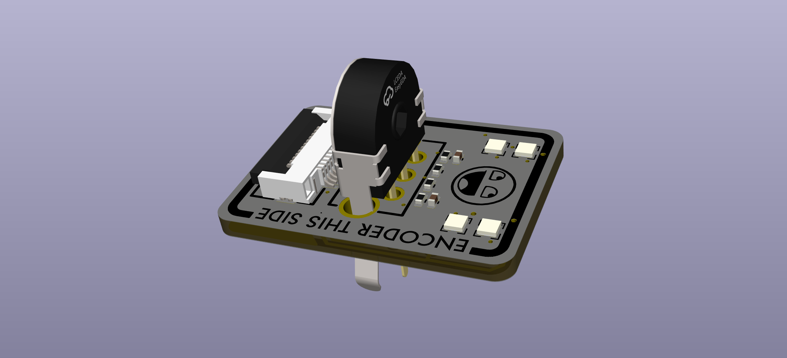
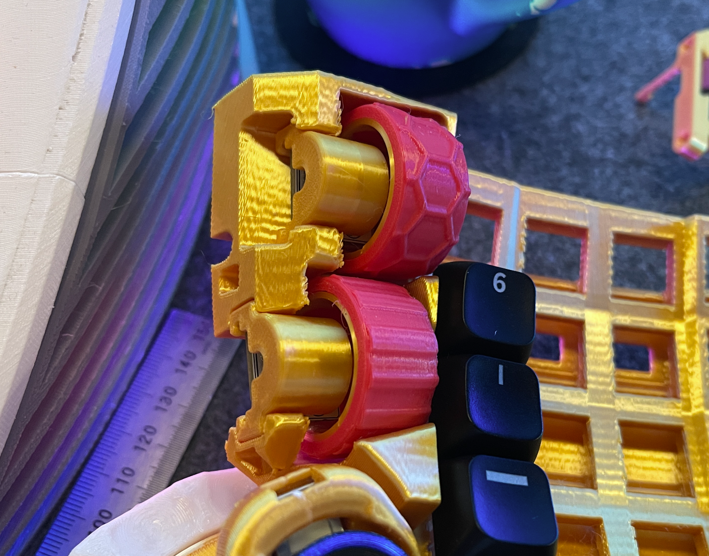
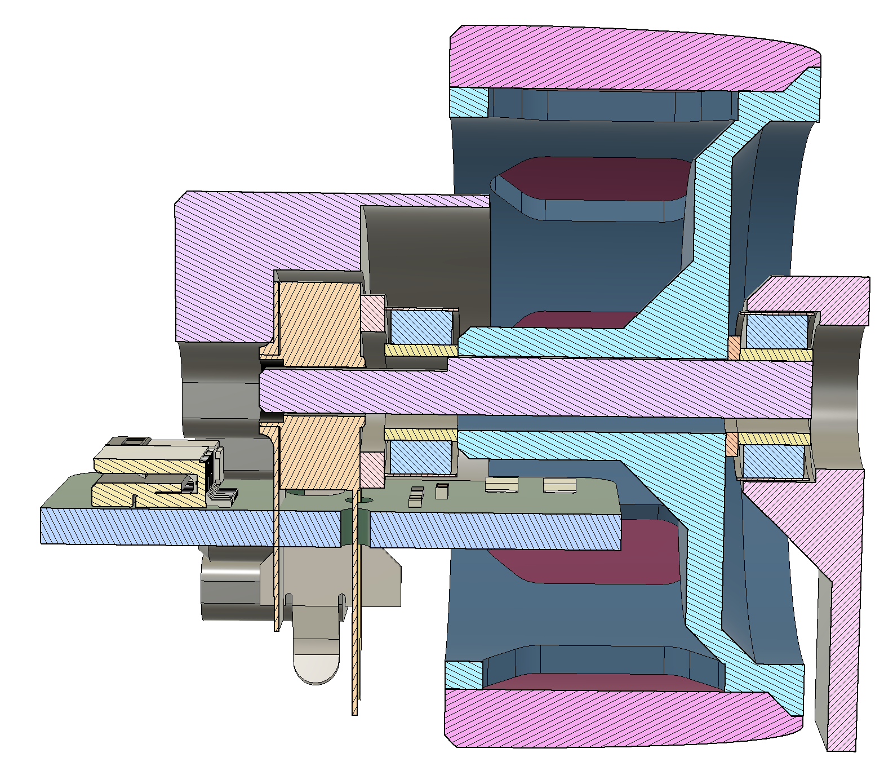
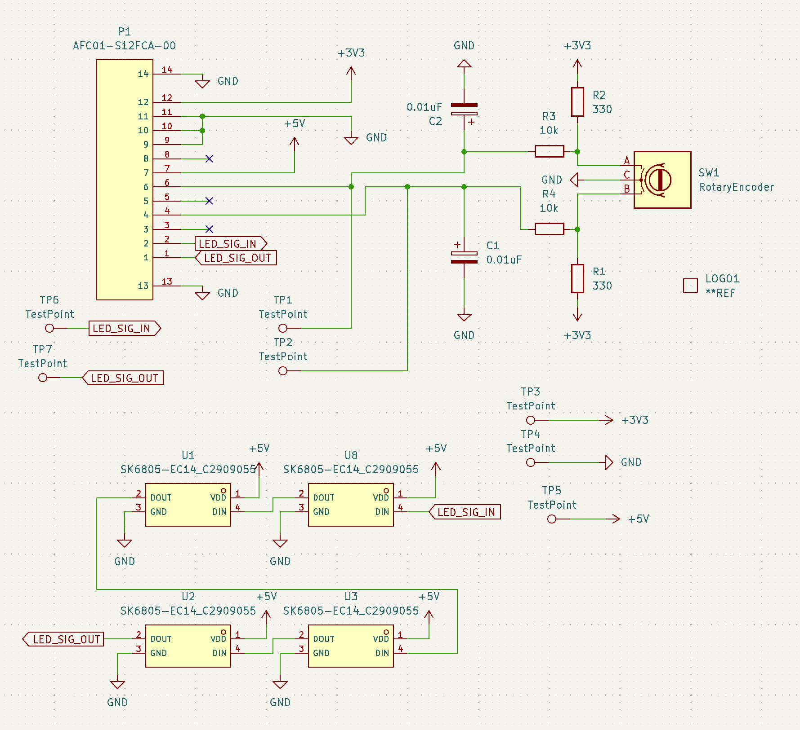
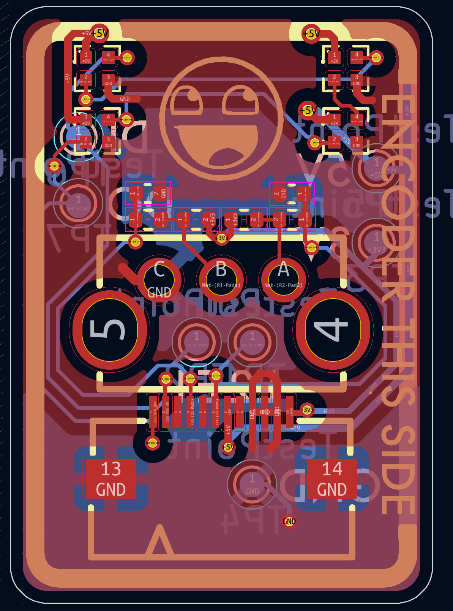
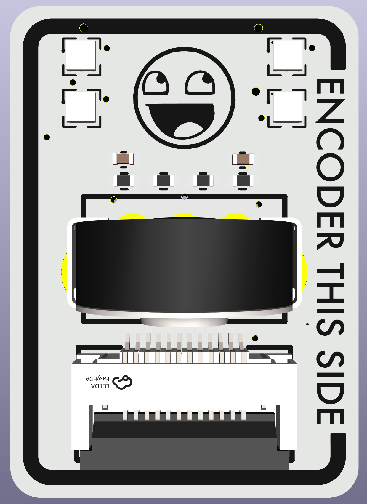

# Overview
mk22 top encoders have a 5mm mouse wheel encoder and four leds.

This pcb is designed to fit inside the 30x15mm encoder wheel.  Why?  So we can shine leds up through the single-wall TPU covering, and so indicate what function the encoder is providing.  It requires the use of 5mm mouse encoders - otherwise the 30mm diameter wheel is too small...and at 30mm, we're already pushing the boundaries of what packaging will allow.

There is a de-noise circuit thingy, inherited from here: https://github.com/christrotter/mouse-encoder-pcb

The FFC connector will hook into the mainboard's giant FFC - see [schematic section](#schematic) for pinout.

## Bill of Materials (BOM)
| Designator | Footprint | Quantity | Value | LCSC Part # |
|-----------------------------|--------------------------|----------|-----------------|--------------|
| C1, C2 | 0402 | 2 | 0.01uF | |
| P1 | FPC-SMD_AFC01-S12FCA-00 | 1 | AFC01-S12FCA-00 | C262661 |
| R1, R2 | 0402 | 2 | 330 | |
| R3, R4 | 0402 | 2 | 10k | |
| U1, U2, U3, U8 | LED-SMD_4P-L1.4-W1.4-TL | 4 | SK6805-EC14_C2909055 | C2909055 |

## Prototype mounting
Uh, ignore the gold silk PLA - just using up rando spools for prototyping.

# Schematic

# PCB layout

